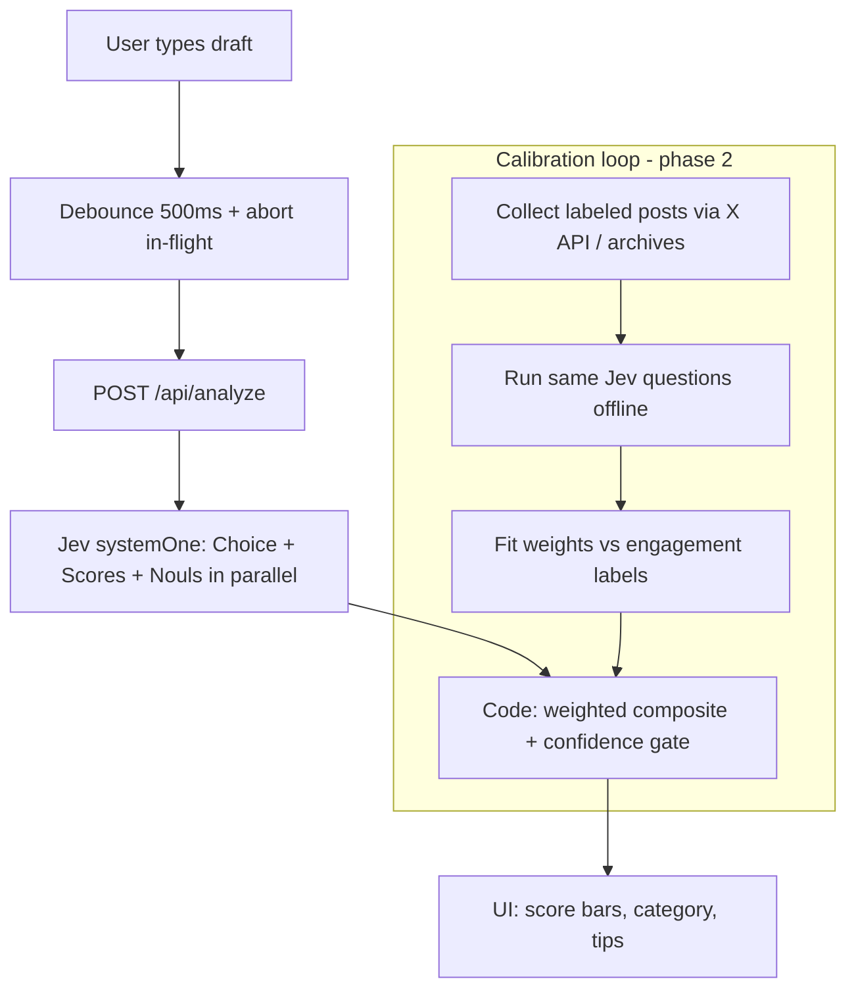

# Live viral post analyzer (Jev)

> Debounced live draft scoring with TypeSafe Jev, plus an X-data calibration loop so “viral potential” is measurable — not vibes.

## Goal
A working local web app: type a post, pause ~0.5s, see viral-dimension scores + category + composite score; a documented data path to calibrate those scores against real X outcomes without ToS-breaking scrapes.

## Diagram

## Approach
- Vite + React UI + Express API + TypeSafe `systemOne` composite scoring.
- Mock mode when `TYPESAFE_API_KEY` is missing.
- No scraping — X API / first-party / licensed archives only (`docs/data-loop.md`).

## Review sign-off
- [x] [CJ-REVIEWED] Completeness
- [x] [STRATEGY-OK] Sibling prototype, not Growth OS bake-in
- [x] [COST-OK] Debounce + abort; mock default
- [x] [LEGAL-OK] No ToS scrape; key server-side
- [x] [DESIGN-OK] Single-screen composer + scores
- [x] [SECURITY-OK] Key never in client bundle
- [x] Founder: authorized plan-then-build

## Steps
- [x] Scaffold app
- [x] Jev questions + weights + mock
- [x] API with abort
- [x] Debounced UI
- [x] data-loop.md + README
- [ ] Live Jev once `TYPESAFE_API_KEY` is set
- [ ] Browser verify when Chrome/preview host available
